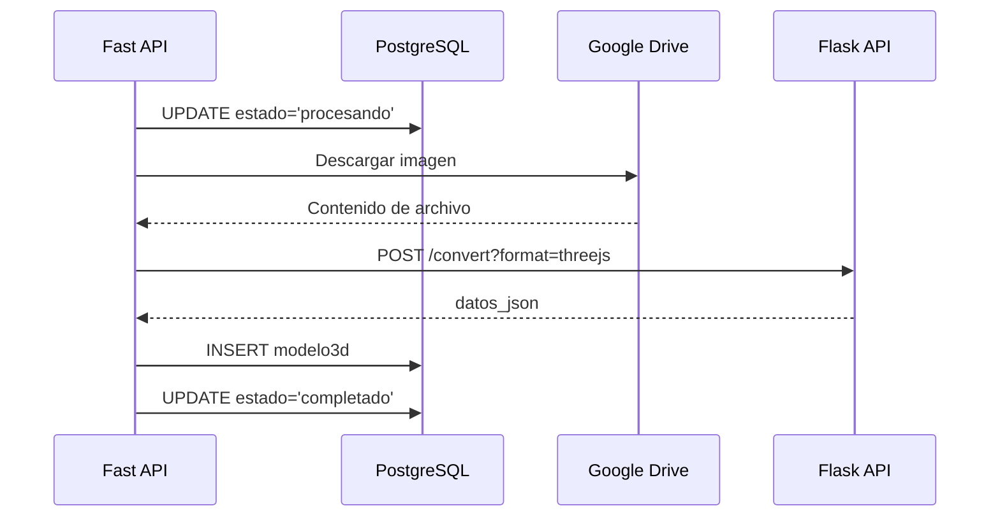

# Guía Técnica de API - Renderizado 3D

## Tabla de Contenidos
1. [Resumen de APIs](#resumen-de-apis)
2. [Fast API (Backend Principal)](#fast-api-backend-principal)
3. [FloorPlanTo3D-API (Procesamiento IA)](#floorplanto3d-api-procesamiento-ia)
4. [Integración Frontend](#integración-frontend)
5. [Formato de Datos](#formato-de-datos)
6. [Manejo de Errores](#manejo-de-errores)
7. [Testing](#testing)

---

## Resumen de APIs

### Flujo de Comunicación

```
Frontend (React) → Fast API → FloorPlanTo3D-API
                     ↓
                PostgreSQL
                     ↓
              Google Drive
```

### Endpoints Disponibles

| API | Endpoint | Método | Propósito |
|-----|----------|--------|-----------|
| Fast API | `/planos/` | POST | Subir nuevo plano |
| Fast API | `/planos/{id}` | GET | Obtener plano por ID |
| Fast API | `/planos/{id}/convertir` | POST | Convertir plano a 3D |
| Fast API | `/planos/{id}/render-3d` | GET | **NUEVO** - Renderizar desde caché |
| Fast API | `/planos/{id}/modelo3d` | GET | Obtener datos JSON del modelo |
| Flask | `/convert` | POST | Convertir imagen a 3D |
| Flask | `/render-from-json` | POST | **NUEVO** - Re-renderizar desde JSON |

---

## Fast API (Backend Principal)

### 1. Subir Plano

**Endpoint:** `POST /planos/`

**Headers:**
```http
Authorization: Bearer {token}
Content-Type: multipart/form-data
```

**Body (FormData):**
```javascript
const formData = new FormData()
formData.append('file', fileObject)
formData.append('nombre', 'mi_plano.jpg')
formData.append('formato', 'image')
formData.append('tipo_plano', 'arquitectónico')
formData.append('descripcion', 'Plano del primer piso')
```

**Response (200 OK):**
```json
{
  "id": 123,
  "usuario_id": 1,
  "nombre": "mi_plano.jpg",
  "url": "https://drive.google.com/uc?export=view&id=1abc...",
  "formato": "image",
  "tipo_plano": "arquitectónico",
  "descripcion": "Plano del primer piso",
  "estado": "subido",
  "fecha_subida": "2024-10-22T10:30:00Z",
  "fecha_actualizacion": "2024-10-22T10:30:00Z",
  "modelo3d": null
}
```

**Validaciones:**
- Tamaño máximo: 10MB
- Formatos permitidos: `.jpg`, `.jpeg`, `.png`, `.pdf`, `.svg`
- Usuario debe estar autenticado

**Código del Servicio:**
```python
# services/plano_service.py

def create_plano(self, plano_data: PlanoCreate, usuario_id: int, 
                 file_content: bytes = None, filename: str = None):
    # 1. Subir a Google Drive
    file_url = google_drive_service.upload_file(
        file_content=file_content,
        filename=filename,
        mime_type='image/jpeg'
    )
    
    # 2. Crear registro en BD
    plano = self.plano_repo.create(plano_data, usuario_id, file_url)
    
    return PlanoResponse.from_orm(plano)
```

---

### 2. Convertir Plano a 3D

**Endpoint:** `POST /planos/{plano_id}/convertir`

**Headers:**
```http
Authorization: Bearer {token}
```

**Response (200 OK):**
```json
{
  "message": "Plano convertido exitosamente"
}
```

**Response (404 Not Found):**
```json
{
  "detail": "Plano no encontrado"
}
```

**Response (500 Error):**
```json
{
  "detail": "Error de conexión con servicio de conversión: ..."
}
```

**Proceso Interno:**



**Código del Servicio:**
```python
# services/plano_service.py

def convertir_a_3d(self, plano_id: int, usuario_id: int):
    plano = self.plano_repo.get_by_id(plano_id, usuario_id)
    
    # Cambiar estado a procesando
    self.plano_repo.update_estado(plano_id, usuario_id, "procesando")
    
    try:
        # Descargar imagen de Google Drive
        file_response = requests.get(plano.url, timeout=30)
        file_content = file_response.content
        
        # Llamar a Flask API
        response = requests.post(
            f"{settings.FLOORPLAN_API_URL}/convert",
            files={"file": (plano.nombre, file_content, "image/png")},
            params={"format": "threejs"},
            timeout=120
        )
        
        datos_json = response.json()
        
        # Guardar modelo3d
        self.modelo3d_repo.update(plano_id, datos_json, "generado")
        
        # Cambiar estado a completado
        self.plano_repo.update_estado(plano_id, usuario_id, "completado")
        
        return {"success": True, "message": "Plano convertido exitosamente"}
        
    except Exception as e:
        self.plano_repo.update_estado(plano_id, usuario_id, "error")
        return {"success": False, "error": str(e)}
```

---

### 3. Renderizar desde Caché (NUEVO)

**Endpoint:** `GET /planos/{plano_id}/render-3d`

**Headers:**
```http
Authorization: Bearer {token}
```

**Response (200 OK):**
```json
{
  "success": true,
  "datos_json": {
    "scene": {
      "name": "FloorPlan3D",
      "units": "meters",
      "bounds": {
        "width": 10.5,
        "height": 8.3
      }
    },
    "objects": [
      {
        "id": "wall_0",
        "type": "wall",
        "position": { "x": 5.25, "y": 1.5, "z": 0.1 },
        "dimensions": { "width": 10.5, "height": 3.0, "depth": 0.2 },
        "rotation": { "x": 0, "y": 0, "z": 0 }
      },
      {
        "id": "door_0",
        "type": "door",
        "position": { "x": 2.5, "y": 1.0, "z": 0.1 },
        "dimensions": { "width": 0.9, "height": 2.0, "depth": 0.05 },
        "rotation": { "x": 0, "y": 0, "z": 0 }
      },
      {
        "id": "window_0",
        "type": "window",
        "position": { "x": 8.0, "y": 1.5, "z": 0.1 },
        "dimensions": { "width": 1.5, "height": 1.5, "depth": 0.05 },
        "rotation": { "x": 0, "y": 0, "z": 0 }
      }
    ],
    "camera": {
      "position": { "x": 7.875, "y": 5.9062, "z": 7.875 },
      "target": { "x": 5.25, "y": 0, "z": 4.15 }
    },
    "medidas_extraidas": {
      "area_total_m2": 87.15,
      "area_paredes_m2": 94.5,
      "area_ventanas_m2": 4.5,
      "perimetro_total_m": 37.6,
      "escala_calculada": 0.0095,
      "num_puertas": 2,
      "num_ventanas": 3,
      "num_paredes": 4
    }
  },
  "from_cache": true,
  "plano_id": 123,
  "fecha_generacion": "2024-10-22T10:35:00Z"
}
```

**Response (404 Not Found):**
```json
{
  "detail": "Modelo 3D no encontrado o aún no ha sido procesado"
}
```

**Ventajas:**
- ⚡ **Rápido:** < 100ms vs ~30s de procesamiento
- 💾 **Eficiente:** No requiere procesamiento de imagen
- 🔋 **Económico:** Sin llamadas a API de IA

**Código del Servicio:**
```python
# services/plano_service.py

def render_modelo3d_from_cache(self, plano_id: int, usuario_id: int):
    """
    Obtener modelo 3D desde caché (datos_json) para re-renderizado rápido.
    """
    modelo3d = self.modelo3d_repo.get_by_plano_id_and_usuario(plano_id, usuario_id)
    
    if not modelo3d or not modelo3d.datos_json:
        return None
    
    return {
        "success": True,
        "datos_json": modelo3d.datos_json,
        "from_cache": True,
        "plano_id": plano_id,
        "fecha_generacion": modelo3d.fecha_generacion.isoformat()
    }
```

---

## FloorPlanTo3D-API (Procesamiento IA)

### 1. Convertir Imagen a 3D

**Endpoint:** `POST /convert?format=threejs`

**Headers:**
```http
Content-Type: multipart/form-data
```

**Body (FormData):**
```javascript
const formData = new FormData()
formData.append('file', imageBlob)
```

**Query Parameters:**
- `format` (opcional): `threejs` | `unity` | `web` (default: `threejs`)

**Response (200 OK):**
```json
{
  "scene": {
    "name": "FloorPlan3D",
    "units": "meters",
    "bounds": {
      "width": 10.5,
      "height": 8.3
    }
  },
  "objects": [
    {
      "id": "wall_0",
      "type": "wall",
      "position": { "x": 5.25, "y": 1.5, "z": 0.1 },
      "dimensions": { "width": 10.5, "height": 3.0, "depth": 0.2 },
      "rotation": { "x": 0, "y": 0, "z": 0 }
    }
  ],
  "camera": {
    "position": { "x": 7.875, "y": 5.9062, "z": 7.875 },
    "target": { "x": 5.25, "y": 0, "z": 4.15 }
  },
  "medidas_extraidas": {
    "area_total_m2": 87.15,
    "area_paredes_m2": 94.5,
    "num_puertas": 2,
    "num_ventanas": 3
  }
}
```

**Procesamiento Interno:**

```python
# application.py

@application.route('/convert', methods=['POST'])
def prediction():
    # 1. Cargar imagen
    imagefile = PIL.Image.open(request.files['file'].stream)
    image, w, h = myImageLoader(imagefile)
    
    # 2. Procesar con Mask R-CNN
    scaled_image = mold_image(image, cfg)
    r = _model.detect(scaled_image, verbose=0)[0]
    
    # 3. Calcular puerta promedio para escala
    bbx = r['rois'].tolist()
    _, average_door = normalizePoints(bbx, r['class_ids'])
    
    # 4. Generar formato Three.js
    data = OutputAdapter.threejs_format(r, w, h, average_door)
    
    return jsonify(data)
```

**Detección de Objetos:**
- **Class 1:** Paredes
- **Class 2:** Ventanas
- **Class 3:** Puertas

---

### 2. Re-renderizar desde JSON (NUEVO)

**Endpoint:** `POST /render-from-json`

**Headers:**
```http
Content-Type: application/json
```

**Body:**
```json
{
  "datos_json": {
    "scene": { ... },
    "objects": [ ... ]
  }
}
```

**Response (200 OK):**
```json
{
  "scene": { ... },
  "objects": [ ... ],
  "metadata": {
    "re_rendered_at": "2024-10-22T11:00:00",
    "rendering_type": "from_cache"
  }
}
```

**Response (400 Bad Request):**
```json
{
  "error": "Invalid datos_json structure"
}
```

**Código:**
```python
# application.py

@application.route('/render-from-json', methods=['POST'])
def render_from_json():
    data = request.get_json()
    
    if 'datos_json' not in data:
        return jsonify({'error': 'Missing datos_json field'}), 400
    
    datos_json = data['datos_json']
    
    # Validar estructura
    if 'scene' not in datos_json or 'objects' not in datos_json:
        return jsonify({'error': 'Invalid datos_json structure'}), 400
    
    # Agregar metadata
    datos_json['metadata'] = {
        're_rendered_at': datetime.now().isoformat(),
        'rendering_type': 'from_cache'
    }
    
    return jsonify(datos_json)
```

---

## Integración Frontend

### Cliente API

```typescript
// lib/api.ts

class ApiClient {
  async createPlano(formData: FormData): Promise<Plano> {
    return this.request<Plano>('/planos/', {
      method: 'POST',
      body: formData,
    })
  }

  async convertirPlanoA3D(id: number): Promise<{ message: string }> {
    return this.request<{ message: string }>(`/planos/${id}/convertir`, {
      method: 'POST',
    })
  }

  async render3DFromCache(id: number): Promise<any> {
    return this.request<any>(`/planos/${id}/render-3d`)
  }
}
```

### Uso en Componentes

```typescript
// Subir y convertir
const handleUpload = async (file: File) => {
  const formData = new FormData()
  formData.append('file', file)
  formData.append('nombre', file.name)
  
  // 1. Subir
  const plano = await apiClient.createPlano(formData)
  
  // 2. Convertir automáticamente
  await apiClient.convertirPlanoA3D(plano.id)
}

// Cargar desde caché
const loadModel = async (planoId: number) => {
  const result = await apiClient.render3DFromCache(planoId)
  
  if (result.success) {
    setModelo3dData(result.datos_json)
  }
}
```

---

## Formato de Datos

### Estructura de datos_json

```typescript
interface Modelo3DData {
  scene: {
    name: string
    units: 'meters'
    bounds: {
      width: number
      height: number
    }
  }
  objects: ThreeJSObject[]
  camera: {
    position: Vector3
    target: Vector3
  }
  medidas_extraidas?: {
    area_total_m2: number
    area_paredes_m2: number
    area_ventanas_m2: number
    perimetro_total_m: number
    num_puertas: number
    num_ventanas: number
    num_paredes: number
  }
}

interface ThreeJSObject {
  id: string
  type: 'wall' | 'window' | 'door'
  position: Vector3
  dimensions: {
    width: number
    height: number
    depth: number
  }
  rotation: Vector3
}

interface Vector3 {
  x: number
  y: number
  z: number
}
```

### Ejemplo Completo

```json
{
  "scene": {
    "name": "FloorPlan3D",
    "units": "meters",
    "bounds": {
      "width": 10.5,
      "height": 8.3
    }
  },
  "objects": [
    {
      "id": "wall_0",
      "type": "wall",
      "position": { "x": 0.0, "y": 1.5, "z": 4.15 },
      "dimensions": { "width": 0.2, "height": 3.0, "depth": 8.3 },
      "rotation": { "x": 0, "y": 0, "z": 0 }
    },
    {
      "id": "wall_1",
      "type": "wall",
      "position": { "x": 5.25, "y": 1.5, "z": 0.0 },
      "dimensions": { "width": 10.5, "height": 3.0, "depth": 0.2 },
      "rotation": { "x": 0, "y": 0, "z": 0 }
    },
    {
      "id": "door_0",
      "type": "door",
      "position": { "x": 2.5, "y": 1.0, "z": 0.1 },
      "dimensions": { "width": 0.9, "height": 2.0, "depth": 0.05 },
      "rotation": { "x": 0, "y": 0, "z": 0 }
    },
    {
      "id": "window_0",
      "type": "window",
      "position": { "x": 8.0, "y": 1.5, "z": 4.15 },
      "dimensions": { "width": 1.5, "height": 1.5, "depth": 0.05 },
      "rotation": { "x": 0, "y": 0, "z": 0 }
    }
  ],
  "camera": {
    "position": { "x": 7.875, "y": 5.9062, "z": 7.875 },
    "target": { "x": 5.25, "y": 0, "z": 4.15 }
  },
  "medidas_extraidas": {
    "area_total_m2": 87.15,
    "area_paredes_m2": 94.5,
    "area_ventanas_m2": 4.5,
    "perimetro_total_m": 37.6,
    "escala_calculada": 0.0095,
    "num_puertas": 2,
    "num_ventanas": 3,
    "num_paredes": 4
  }
}
```

---

## Manejo de Errores

### Códigos de Estado HTTP

| Código | Significado | Acción |
|--------|-------------|--------|
| 200 | OK | Operación exitosa |
| 400 | Bad Request | Validar datos de entrada |
| 401 | Unauthorized | Renovar token de autenticación |
| 404 | Not Found | Recurso no existe |
| 500 | Server Error | Contactar soporte |

### Errores Comunes

#### 1. Archivo muy grande
```json
{
  "detail": "El archivo es demasiado grande. Tamaño máximo: 10MB"
}
```
**Solución:** Comprimir imagen antes de subir

#### 2. Formato no soportado
```json
{
  "detail": "Tipo de archivo no permitido. Extensiones permitidas: .jpg, .jpeg, .png, .pdf, .svg"
}
```
**Solución:** Convertir a formato soportado

#### 3. Modelo 3D no procesado
```json
{
  "detail": "Modelo 3D no encontrado o aún no ha sido procesado"
}
```
**Solución:** Esperar a que termine el procesamiento o verificar estado del plano

#### 4. Error de conexión con Flask API
```json
{
  "detail": "Error de conexión con servicio de conversión: Connection timeout"
}
```
**Solución:** Verificar que Flask API esté corriendo

---

## Testing

### Test de Subida

```python
# test_planos.py

def test_create_plano(client, auth_headers):
    with open('test_image.png', 'rb') as f:
        response = client.post(
            '/planos/',
            files={'file': ('test.png', f, 'image/png')},
            data={
                'nombre': 'test_plano',
                'formato': 'image',
                'tipo_plano': 'arquitectónico'
            },
            headers=auth_headers
        )
    
    assert response.status_code == 200
    data = response.json()
    assert data['nombre'] == 'test_plano'
    assert data['estado'] == 'subido'
```

### Test de Conversión

```python
def test_convertir_plano(client, auth_headers, plano_id):
    response = client.post(
        f'/planos/{plano_id}/convertir',
        headers=auth_headers
    )
    
    assert response.status_code == 200
    data = response.json()
    assert data['message'] == 'Plano convertido exitosamente'
```

### Test de Caché

```python
def test_render_from_cache(client, auth_headers, plano_id):
    response = client.get(
        f'/planos/{plano_id}/render-3d',
        headers=auth_headers
    )
    
    assert response.status_code == 200
    data = response.json()
    assert data['success'] == True
    assert data['from_cache'] == True
    assert 'datos_json' in data
```

---

**Última actualización:** Octubre 2025  
**Versión API:** 1.0

