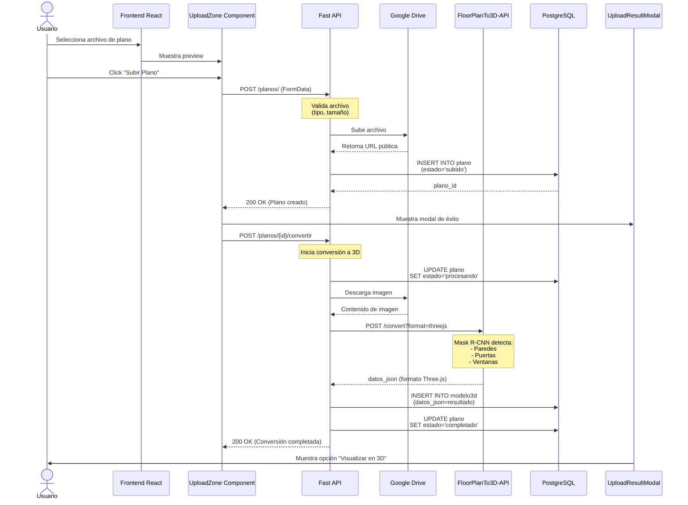
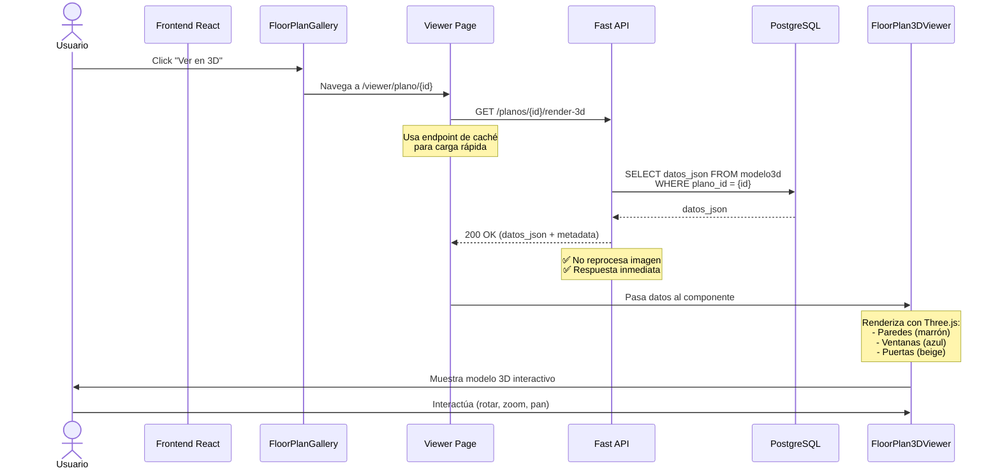
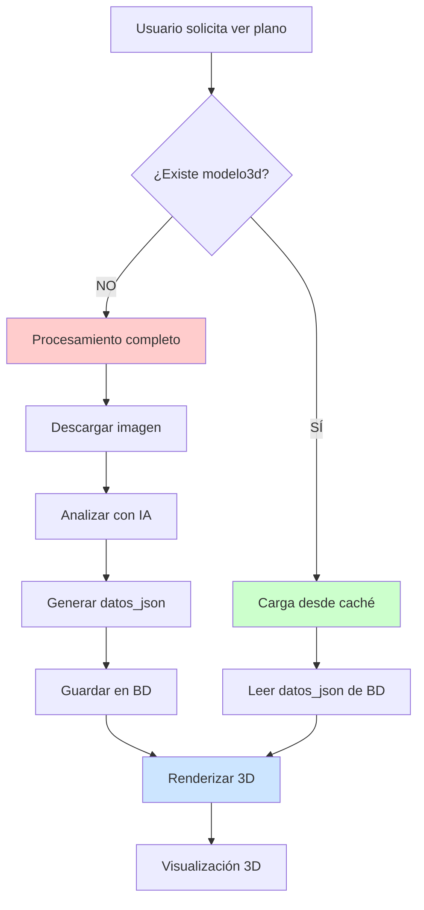
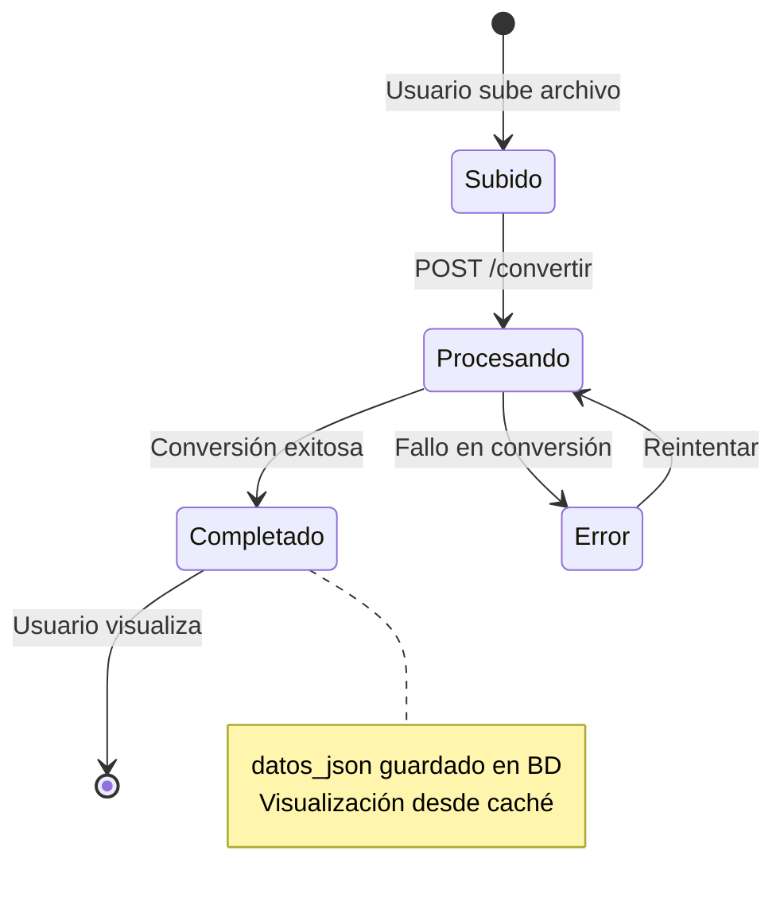
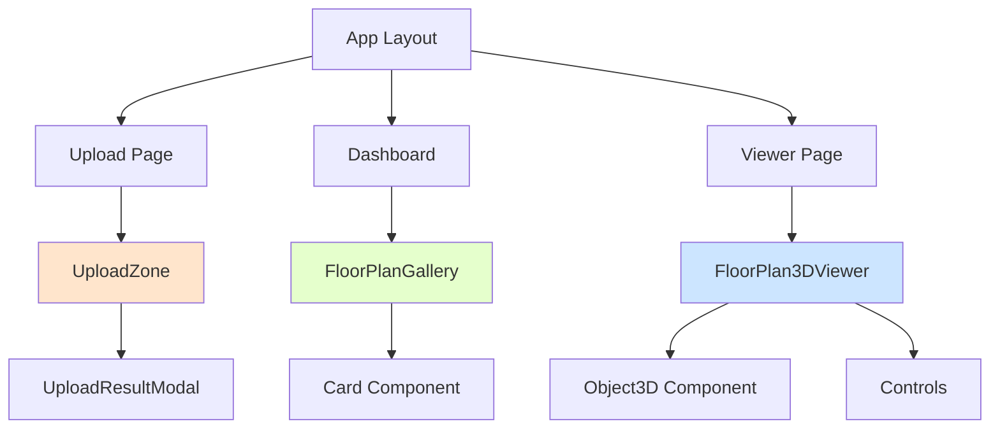
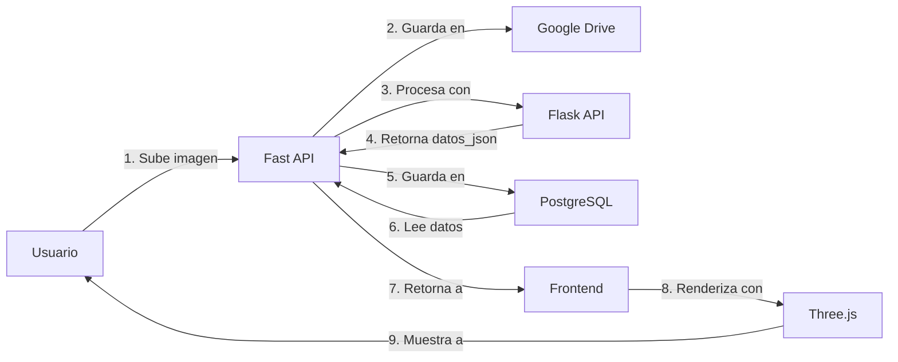

# Implementación de Renderizado 3D de Planos

## Índice
1. [Resumen Ejecutivo](#resumen-ejecutivo)
2. [Arquitectura del Sistema](#arquitectura-del-sistema)
3. [Flujo de Subida de Planos](#flujo-de-subida-de-planos)
4. [Flujo de Visualización 3D](#flujo-de-visualización-3d)
5. [Componentes Principales](#componentes-principales)
6. [Endpoints de API](#endpoints-de-api)
7. [Optimizaciones](#optimizaciones)
8. [Guía de Uso](#guía-de-uso)

---

## Resumen Ejecutivo

Esta implementación permite a los usuarios:
1. **Subir planos 2D** a la plataforma
2. **Convertir automáticamente** los planos a modelos 3D usando IA
3. **Visualizar los modelos 3D** en un viewer interactivo basado en Three.js
4. **Re-renderizar rápidamente** modelos ya procesados sin volver a analizar la imagen

### Características Clave
- ✅ Conversión automática de 2D a 3D al subir
- ✅ Almacenamiento de datos procesados en `datos_json`
- ✅ Caché de modelos 3D para carga rápida
- ✅ Visualización interactiva con Three.js
- ✅ Detección de paredes, puertas y ventanas
- ✅ Modal de éxito/error después de subir

---

## Arquitectura del Sistema

### Stack Tecnológico

```
┌─────────────────────────────────────────────────────────────┐
│                      FRONTEND (Next.js)                      │
│  - React 18                                                  │
│  - Three.js / React Three Fiber                              │
│  - TypeScript                                                │
│  - Tailwind CSS                                              │
└─────────────────────────────────────────────────────────────┘
                              ↕
┌─────────────────────────────────────────────────────────────┐
│                   FAST API (Intermediario)                   │
│  - FastAPI (Python)                                          │
│  - SQLAlchemy ORM                                            │
│  - PostgreSQL                                                │
│  - Google Drive Storage                                      │
└─────────────────────────────────────────────────────────────┘
                              ↕
┌─────────────────────────────────────────────────────────────┐
│                FloorPlanTo3D-API (Procesamiento)             │
│  - Flask (Python)                                            │
│  - TensorFlow + Mask R-CNN                                   │
│  - Computer Vision                                           │
│  - Formato Three.js                                          │
└─────────────────────────────────────────────────────────────┘
```

### Modelos de Base de Datos

#### Tabla: `plano`
```sql
CREATE TABLE plano (
    id SERIAL PRIMARY KEY,
    usuario_id INTEGER NOT NULL,
    nombre VARCHAR(255) NOT NULL,
    url TEXT,                      -- URL de Google Drive
    formato VARCHAR(50),
    tipo_plano VARCHAR(100),
    descripcion TEXT,
    estado VARCHAR(24),            -- 'subido', 'procesando', 'completado', 'error'
    fecha_subida TIMESTAMP,
    fecha_actualizacion TIMESTAMP
);
```

#### Tabla: `modelo3d`
```sql
CREATE TABLE modelo3d (
    id SERIAL PRIMARY KEY,
    plano_id INTEGER UNIQUE NOT NULL,
    datos_json JSON NOT NULL,      -- Datos del modelo en formato Three.js
    estado_renderizado VARCHAR(24),
    fecha_generacion TIMESTAMP,
    fecha_actualizacion TIMESTAMP
);
```

---

## Flujo de Subida de Planos

### Diagrama de Secuencia



### Código de Subida (UploadZone)

```typescript
// components/upload-zone.tsx

const handleUpload = async () => {
  const formData = new FormData()
  formData.append('file', file)
  formData.append('nombre', file.name)
  formData.append('formato', file.type.split('/')[1])
  
  // 1. Subir plano
  const plano = await apiClient.createPlano(formData)
  
  // 2. Mostrar modal de éxito
  setUploadedPlano(plano)
  setShowResultModal(true)
  
  // 3. Iniciar conversión automática
  await apiClient.convertirPlanoA3D(plano.id)
}
```

---

## Flujo de Visualización 3D

### Diagrama de Secuencia



### Primera Carga vs Carga desde Caché



### Código de Visualización

```typescript
// app/viewer/plano/[planoId]/page.tsx

const loadPlanoData = async () => {
  // 1. Obtener información del plano
  const planoData = await apiClient.getPlano(parseInt(planoId))
  
  // 2. Si está completado, cargar desde caché
  if (planoData.estado === 'completado') {
    const cachedData = await apiClient.render3DFromCache(parseInt(planoId))
    
    if (cachedData && cachedData.success) {
      // ✅ Datos cargados desde caché (rápido)
      setModelo3dData({ datos_json: cachedData.datos_json })
    }
  }
}
```

---

## Componentes Principales

### 1. UploadZone Component

**Ubicación:** `components/upload-zone.tsx`

**Responsabilidades:**
- Drag & drop de archivos
- Preview de archivos seleccionados
- Subida a Fast API
- Inicio de conversión automática
- Muestra modal de resultado

**Estados:**
```typescript
const [selectedFiles, setSelectedFiles] = useState<File[]>([])
const [processing, setProcessing] = useState(false)
const [uploadedPlano, setUploadedPlano] = useState<Plano | null>(null)
const [showResultModal, setShowResultModal] = useState(false)
```

### 2. UploadResultModal Component

**Ubicación:** `components/upload-result-modal.tsx`

**Responsabilidades:**
- Mostrar resultado de subida (éxito/error)
- Botones de acción contextual
- Navegación a visualización o dashboard

**Props:**
```typescript
interface UploadResultModalProps {
  plano: Plano | null
  error: string | null
  onClose: () => void
  onConvert?: (planoId: number) => void
}
```

### 3. FloorPlanGallery Component

**Ubicación:** `components/floor-plan-gallery.tsx`

**Responsabilidades:**
- Grid de planos del usuario
- Quick actions (Ver 3D, Convertir, Eliminar)
- Preview de imágenes
- Estados visuales (subido, procesando, completado)

### 4. FloorPlan3DViewer Component

**Ubicación:** `components/floor-plan-3d-viewer.tsx`

**Responsabilidades:**
- Renderizado 3D con Three.js
- Controles de cámara (OrbitControls)
- Iluminación y sombras
- Representación de objetos detectados

**Renderizado de Objetos:**
```typescript
function Object3D({ obj }: { obj: ThreeJSObject }) {
  const getColor = (type: string) => {
    switch (type) {
      case 'wall': return '#8B4513'    // Marrón
      case 'window': return '#87CEEB'  // Azul cielo
      case 'door': return '#DEB887'    // Beige
    }
  }
  
  return (
    <mesh position={[obj.position.x, obj.position.y, obj.position.z]}>
      <boxGeometry args={[obj.dimensions.width, obj.dimensions.height, obj.dimensions.depth]} />
      <meshStandardMaterial color={getColor(obj.type)} />
    </mesh>
  )
}
```

### 5. Viewer Page

**Ubicación:** `app/viewer/plano/[planoId]/page.tsx`

**Responsabilidades:**
- Carga de datos del plano
- Manejo de estados (loading, error, success)
- Integración con FloorPlan3DViewer
- Controles de usuario

---

## Endpoints de API

### Fast API (Backend)

#### 1. Subir Plano
```http
POST /planos/
Content-Type: multipart/form-data

file: <archivo_imagen>
nombre: "mi_plano.jpg"
formato: "image"
tipo_plano: "arquitectónico"
descripcion: "Descripción del plano"

→ 200 OK
{
  "id": 123,
  "nombre": "mi_plano.jpg",
  "estado": "subido",
  "url": "https://drive.google.com/...",
  ...
}
```

#### 2. Convertir a 3D
```http
POST /planos/{plano_id}/convertir

→ 200 OK
{
  "message": "Plano convertido exitosamente"
}
```

#### 3. Renderizar desde Caché (Nuevo)
```http
GET /planos/{plano_id}/render-3d

→ 200 OK
{
  "success": true,
  "datos_json": {
    "scene": {
      "name": "FloorPlan3D",
      "units": "meters",
      "bounds": { "width": 10, "height": 8 }
    },
    "objects": [
      {
        "id": "wall_0",
        "type": "wall",
        "position": { "x": 5, "y": 1.5, "z": 0 },
        "dimensions": { "width": 10, "height": 3, "depth": 0.2 }
      },
      ...
    ],
    "camera": {
      "position": { "x": 8, "y": 6, "z": 8 },
      "target": { "x": 5, "y": 0, "z": 4 }
    }
  },
  "from_cache": true,
  "plano_id": 123
}
```

#### 4. Obtener Datos JSON del Modelo
```http
GET /planos/{plano_id}/modelo3d

→ 200 OK
{
  "datos_json": { ... }
}
```

### FloorPlanTo3D-API (Flask)

#### 1. Convertir Imagen a 3D
```http
POST /convert?format=threejs
Content-Type: multipart/form-data

file: <archivo_imagen>

→ 200 OK
{
  "scene": { ... },
  "objects": [ ... ],
  "camera": { ... },
  "medidas_extraidas": {
    "area_total_m2": 80.5,
    "area_paredes_m2": 120.3,
    "num_puertas": 3,
    "num_ventanas": 5
  }
}
```

#### 2. Re-renderizar desde JSON (Nuevo)
```http
POST /render-from-json
Content-Type: application/json

{
  "datos_json": {
    "scene": { ... },
    "objects": [ ... ]
  }
}

→ 200 OK
{
  "scene": { ... },
  "objects": [ ... ],
  "metadata": {
    "re_rendered_at": "2024-01-15T10:30:00",
    "rendering_type": "from_cache"
  }
}
```

---

## Optimizaciones

### 1. Caché de Modelos 3D

**Problema:** Re-procesar imágenes es costoso en tiempo y recursos.

**Solución:** Almacenar `datos_json` en la base de datos.

```python
# services/plano_service.py

def render_modelo3d_from_cache(self, plano_id: int, usuario_id: int):
    """
    Obtener modelo 3D desde caché (datos_json) para re-renderizado rápido.
    No requiere volver a procesar la imagen.
    """
    modelo3d = self.modelo3d_repo.get_by_plano_id_and_usuario(plano_id, usuario_id)
    
    if modelo3d and modelo3d.datos_json:
        return {
            "success": True,
            "datos_json": modelo3d.datos_json,
            "from_cache": True
        }
```

**Beneficios:**
- ⚡ Carga instantánea (< 100ms vs ~30s de procesamiento)
- 💰 Ahorro de recursos computacionales
- 🔋 Menor consumo de API de IA

### 2. Conversión Automática

Al subir un plano, se inicia automáticamente la conversión a 3D:

```typescript
// Después de subir exitosamente
try {
  await apiClient.convertirPlanoA3D(plano.id)
  toast.success('Conversión a 3D iniciada')
} catch (error) {
  // No bloqueante - usuario puede convertir manualmente después
}
```

### 3. Google Drive para Almacenamiento

- URLs públicas para acceso directo
- Sin ocupar espacio en servidor
- CDN global de Google

### 4. Formato Three.js Optimizado

La API Flask retorna datos directamente en formato Three.js:

```json
{
  "scene": {
    "bounds": { "width": 10, "height": 8 }
  },
  "objects": [
    {
      "position": { "x": 5, "y": 1.5, "z": 0 },
      "dimensions": { "width": 10, "height": 3, "depth": 0.2 },
      "rotation": { "x": 0, "y": 0, "z": 0 }
    }
  ]
}
```

No requiere transformaciones adicionales en el frontend.

---

## Guía de Uso

### Para Usuarios

#### 1. Subir un Plano

1. Ir a `/upload`
2. Arrastrar archivo o hacer click para seleccionar
3. Click en "Subir Plano"
4. Esperar modal de confirmación
5. Click en "Visualizar en 3D" o "Ir al Dashboard"

#### 2. Visualizar en 3D

1. Ir a Dashboard o Galería
2. Click en "Ver en 3D" en cualquier plano completado
3. Interactuar con el modelo:
   - **Click + Arrastrar:** Rotar vista
   - **Scroll:** Zoom in/out
   - **Click Derecho + Arrastrar:** Mover cámara
   - **Botón "Auto Rotar":** Rotación automática

#### 3. Convertir Plano Existente

Si un plano está en estado "subido":
1. En la galería, hover sobre el plano
2. Click en "Convertir a 3D"
3. Confirmar conversión
4. Esperar procesamiento (~30 segundos)

### Para Desarrolladores

#### Agregar Nuevo Tipo de Objeto

1. **Actualizar Flask API:**
```python
# application.py - en getClassNames()
if classid == 4:
    data['name'] = 'furniture'  # Nuevo tipo
```

2. **Actualizar Frontend:**
```typescript
// floor-plan-3d-viewer.tsx
const getColor = (type: string) => {
  switch (type) {
    case 'furniture':
      return '#FF6347'  // Tomate
    // ...
  }
}
```

#### Modificar Formato de Salida

Editar `OutputAdapter.threejs_format()` en `application.py`:

```python
@staticmethod
def threejs_format(detection_result, w, h, average_door):
    objects = []
    
    for i, bbox in enumerate(bbx):
        obj = {
            'id': f"{obj_type}_{i}",
            'type': obj_type,
            # Agregar nuevos campos aquí
            'material': 'concrete',
            'texture': 'wall_texture.jpg'
        }
        objects.append(obj)
```

#### Agregar Validaciones

```python
# routers/planos.py

@router.post("/")
async def create_plano(...):
    # Validaciones personalizadas
    if file_size > 10 * 1024 * 1024:
        raise HTTPException(status_code=400, detail="Archivo muy grande")
    
    if not file_extension in ['.jpg', '.png', '.pdf']:
        raise HTTPException(status_code=400, detail="Formato no soportado")
```

---

## Diagramas Adicionales

### Ciclo de Vida de un Plano



### Arquitectura de Componentes (Frontend)



### Flujo de Datos



---

## Conclusión

Esta implementación proporciona:
- ✅ **Experiencia fluida** de subida y visualización
- ✅ **Optimización de rendimiento** mediante caché
- ✅ **Escalabilidad** con Google Drive y PostgreSQL
- ✅ **Modularidad** con arquitectura de microservicios
- ✅ **Extensibilidad** para nuevas características

### Próximos Pasos Sugeridos

1. **Mejoras de IA:**
   - Detectar más tipos de objetos (muebles, escaleras)
   - Mejorar precisión de detección

2. **Características Adicionales:**
   - Exportar modelos a formatos estándar (OBJ, FBX)
   - Mediciones interactivas en el viewer
   - Colaboración en tiempo real

3. **Optimizaciones:**
   - Compresión de datos_json
   - WebGL optimizations
   - Progressive loading

---

**Fecha de última actualización:** Octubre 2025  
**Versión:** 1.0  
**Autor:** Sistema FloorPlanTo3D

