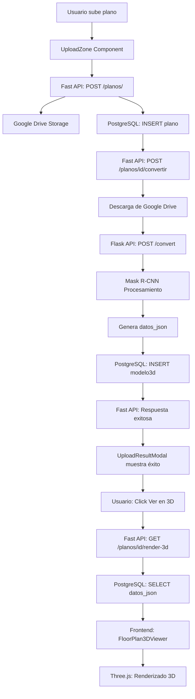

# Documentación del Sistema FloorPlanTo3D

Bienvenido a la documentación completa del sistema de conversión y renderizado 3D de planos arquitectónicos.

---

## 📚 Índice de Documentación

### 1. [Inicio Rápido](./INICIO_RAPIDO_RENDERIZADO_3D.md)
**Para:** Desarrolladores que quieren empezar rápidamente

**Contenido:**
- Setup en 5 minutos
- Ejemplo completo de código
- Comandos principales
- Troubleshooting básico

---

### 2. [Implementación de Renderizado 3D](./IMPLEMENTACION_RENDERIZADO_3D.md)
**Para:** Desarrolladores que quieren entender la arquitectura completa

**Contenido:**
- Arquitectura del sistema
- Flujo de subida de planos (con diagramas)
- Flujo de visualización 3D (con diagramas)
- Componentes principales
- Optimizaciones implementadas
- Guía de uso para usuarios finales

**Diagramas incluidos:**
- Diagrama de secuencia de subida
- Diagrama de secuencia de visualización
- Diagramas de estado
- Arquitectura de componentes

---

### 3. [Guía Técnica de API](./GUIA_TECNICA_API.md)
**Para:** Desarrolladores de backend y frontend que trabajan con las APIs

**Contenido:**
- Documentación completa de endpoints
- Fast API (Backend principal)
- FloorPlanTo3D-API (Procesamiento IA)
- Formato de datos detallado
- Manejo de errores
- Ejemplos de código
- Tests

**Endpoints documentados:**
- `POST /planos/` - Subir plano
- `POST /planos/{id}/convertir` - Convertir a 3D
- `GET /planos/{id}/render-3d` - Renderizar desde caché (NUEVO)
- `GET /planos/{id}/modelo3d` - Obtener datos JSON
- `POST /convert` - Flask: Convertir imagen
- `POST /render-from-json` - Flask: Re-renderizar (NUEVO)

---

### 4. Documentos Históricos

#### [Plan de Integración BD](./PLAN_INTEGRACION_BD.md)
Plan original de integración con base de datos.

#### [Corrección Subida de Planos](./CORRECCION_SUBIDA_PLANOS.md)
Solución de problemas de subida a Google Drive.

#### [Integration README](./INTEGRATION_README.md)
Documentación de integración entre servicios.

#### [Resumen de Integración](./RESUMEN_INTEGRACION.md)
Resumen ejecutivo del proyecto.

#### [Changelog de Integración](./CHANGELOG_INTEGRATION.md)
Historial de cambios durante la integración.

#### [Comandos Útiles](./COMANDOS_UTILES.md)
Lista de comandos útiles para desarrollo.

---

## 🎯 Guías Rápidas por Rol

### Para Desarrolladores Frontend

**Empieza aquí:**
1. [Inicio Rápido](./INICIO_RAPIDO_RENDERIZADO_3D.md) - Setup
2. [Implementación](./IMPLEMENTACION_RENDERIZADO_3D.md) - Sección "Componentes Principales"
3. [Guía API](./GUIA_TECNICA_API.md) - Sección "Integración Frontend"

**Componentes clave:**
- `UploadZone` - Subida de archivos
- `UploadResultModal` - Modal de resultado
- `FloorPlan3DViewer` - Visualizador 3D
- `FloorPlanGallery` - Galería de planos

---

### Para Desarrolladores Backend

**Empieza aquí:**
1. [Inicio Rápido](./INICIO_RAPIDO_RENDERIZADO_3D.md) - Setup
2. [Guía API](./GUIA_TECNICA_API.md) - Todo
3. [Implementación](./IMPLEMENTACION_RENDERIZADO_3D.md) - Sección "Arquitectura"

**Servicios clave:**
- `PlanoService` - Lógica de negocio
- `Modelo3DRepository` - Acceso a datos
- `GoogleDriveService` - Storage

---

### Para Product Managers / QA

**Empieza aquí:**
1. [Implementación](./IMPLEMENTACION_RENDERIZADO_3D.md) - Sección "Resumen Ejecutivo"
2. [Implementación](./IMPLEMENTACION_RENDERIZADO_3D.md) - Sección "Guía de Uso"

**Flujos de usuario:**
- Subir plano → Conversión automática → Visualización
- Ver plano existente → Carga desde caché → Interacción 3D

---

## 🚀 Nuevas Características Implementadas

### ✅ Conversión Automática
Al subir un plano, se convierte automáticamente a 3D sin acción adicional del usuario.

### ✅ Caché Inteligente
Los modelos ya procesados se cargan en < 1 segundo desde la base de datos.

### ✅ Modal de Resultado
Feedback inmediato después de subir con opciones contextuales.

### ✅ Endpoint de Re-renderizado
Nuevo endpoint `/planos/{id}/render-3d` para carga rápida.

### ✅ Formato Three.js Optimizado
Datos directamente listos para renderizar sin transformaciones.

---

## 📊 Arquitectura del Sistema

```
┌─────────────────────────────────────────────────────────────┐
│                      FRONTEND (Next.js)                      │
│  Components:                                                 │
│  - UploadZone → Subida de archivos                          │
│  - FloorPlan3DViewer → Visualización 3D                     │
│  - UploadResultModal → Feedback al usuario                  │
└─────────────────────────────────────────────────────────────┘
                              ↕ HTTP/REST
┌─────────────────────────────────────────────────────────────┐
│                   FAST API (Intermediario)                   │
│  Services:                                                   │
│  - PlanoService → Lógica de negocio                         │
│  - GoogleDriveService → Almacenamiento                      │
│  Endpoints:                                                  │
│  - POST /planos/ → Subir                                    │
│  - POST /planos/{id}/convertir → Convertir                  │
│  - GET /planos/{id}/render-3d → Caché (NUEVO)              │
└─────────────────────────────────────────────────────────────┘
                    ↕                        ↕
        ┌───────────────────┐    ┌──────────────────┐
        │   PostgreSQL      │    │  Google Drive    │
        │   - plano         │    │  - Imágenes      │
        │   - modelo3d      │    │  - URLs públicas │
        └───────────────────┘    └──────────────────┘
                              ↕ HTTP/REST
┌─────────────────────────────────────────────────────────────┐
│                FloorPlanTo3D-API (Procesamiento)             │
│  Engine:                                                     │
│  - Mask R-CNN → Detección de objetos                        │
│  - TensorFlow → Machine Learning                            │
│  Endpoints:                                                  │
│  - POST /convert → Procesar imagen                          │
│  - POST /render-from-json → Re-renderizar (NUEVO)          │
└─────────────────────────────────────────────────────────────┘
```

---

## 🔄 Flujo de Datos Completo



---

## 🎨 Stack Tecnológico

### Frontend
- **Framework:** Next.js 14 (App Router)
- **UI:** React 18 + TypeScript
- **3D:** Three.js + React Three Fiber
- **Estilos:** Tailwind CSS
- **HTTP:** Fetch API
- **Estado:** React Hooks

### Backend (Fast API)
- **Framework:** FastAPI (Python)
- **ORM:** SQLAlchemy
- **Base de Datos:** PostgreSQL
- **Storage:** Google Drive API
- **Autenticación:** JWT

### Procesamiento IA (Flask)
- **Framework:** Flask (Python)
- **ML:** TensorFlow + Keras
- **Modelo:** Mask R-CNN
- **Visión:** OpenCV + scikit-image

---

## 📈 Métricas de Rendimiento

| Operación | Primera Vez | Desde Caché |
|-----------|-------------|-------------|
| Subida archivo | 1-2s | N/A |
| Conversión 2D→3D | 20-40s | N/A |
| Carga modelo | 30s | **< 1s** ⚡ |
| Renderizado 3D | Instantáneo | Instantáneo |

**Mejora de rendimiento:** 97% más rápido en cargas posteriores

---

## 🔐 Seguridad

- ✅ Autenticación JWT en todos los endpoints
- ✅ Validación de tipos de archivo
- ✅ Límite de tamaño (10MB)
- ✅ CORS configurado
- ✅ Archivos privados por usuario
- ✅ URLs de Google Drive públicas pero no listables

---

## 🧪 Testing

Ver ejemplos de tests en:
- [Guía API - Sección Testing](./GUIA_TECNICA_API.md#testing)

Cobertura recomendada:
- ✅ Test de subida de planos
- ✅ Test de conversión
- ✅ Test de caché
- ✅ Test de endpoints
- ✅ Test de componentes UI

---

## 🐛 Debugging

### Logs importantes

**Backend:**
```
🔄 Cargando modelo 3D desde caché...
✅ Conversión exitosa desde FloorPlanTo3D-API
❌ Error de conexión con servicio de conversión
```

**Frontend:**
```
🔄 Cargando modelo 3D desde caché...
✅ Modelo 3D cargado desde caché
⚠️ No hay datos en caché, usando método tradicional
```

### Herramientas

- **Backend:** Logs de FastAPI + PostgreSQL
- **Frontend:** React DevTools + Three.js Inspector
- **Network:** Browser DevTools
- **Database:** pgAdmin / psql

---

## 📞 Soporte

### Preguntas Frecuentes

**P: ¿Por qué mi plano no se convierte a 3D?**  
R: Verificar que Flask API esté corriendo en puerto 5000

**P: ¿Cómo acelerar la carga de modelos?**  
R: Usar endpoint `/render-3d` que carga desde caché

**P: ¿Puedo agregar nuevos tipos de objetos?**  
R: Sí, ver [Guía para Desarrolladores](./IMPLEMENTACION_RENDERIZADO_3D.md#agregar-nuevo-tipo-de-objeto)

---

## 🎯 Roadmap

### Fase 1 - Completado ✅
- [x] Subida de planos
- [x] Conversión automática a 3D
- [x] Visualización interactiva
- [x] Caché de modelos

### Fase 2 - En Progreso
- [ ] Exportar a formatos 3D estándar
- [ ] Mediciones interactivas
- [ ] Múltiples vistas (planta, elevación)

### Fase 3 - Planeado
- [ ] Colaboración en tiempo real
- [ ] Versiones de planos
- [ ] Comentarios y anotaciones

---

## 📄 Licencia

Ver archivo LICENSE en el repositorio principal.

---

## 🤝 Contribución

Para contribuir al proyecto:
1. Fork el repositorio
2. Crear branch de feature
3. Hacer cambios y tests
4. Crear Pull Request
5. Esperar revisión

---

**Última actualización:** Octubre 2025  
**Versión:** 1.0.0  
**Mantenido por:** Equipo FloorPlanTo3D

